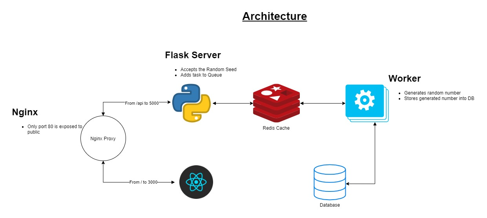

Task Manager — Dockerized Microservices Stack

## Architecture Diagram



Overview

Task Manager is a containerized web application that demonstrates how multiple services can run together using Docker Compose.

The system is designed with a microservices architecture and includes:

Nginx as a Load Balancer and Reverse Proxy
Flask backend running multiple instances
PostgreSQL as the main database
Redis as an in-memory cache
Docker Compose for orchestration

This project simulates a real production-style environment where multiple services interact together in a scalable architecture.

Architecture

The application is composed of the following services:

Service	Description
Nginx	Reverse proxy and load balancer
Flask (2 instances)	Backend API containers
PostgreSQL	Persistent relational database
Redis	In-memory cache for performance
Docker Compose	Orchestrates all services
```
Request Flow
User
  │
  ▼
Nginx (Load Balancer)
  │
  ▼
Flask Containers (Multiple Instances)
  │
  ├────► Redis (Caching Layer)
  │
  ▼
PostgreSQL (Database)
Project Structure
task-manager/
│
├── flask_app.py
├── requirements.txt
├── init.sql
│
├── conf/
│   └── nginx.conf
│
├── ssl/
│   └── generate_ssl.sh
│
├── static/
│
├── .env
├── .env.example
│
└── docker-compose.yml
```
Features
Multi-container Docker architecture
Load balancing using Nginx
Scalable backend using multiple Flask containers
PostgreSQL for persistent data storage
Redis caching layer
SSL support for secure local development
Environment variable configuration
Prerequisites

Before running the project, make sure you have installed:

Docker
Docker Compose
Git

Verify installation:

docker --version
docker compose version
Setup and Run
1 Clone the Repository
git clone https://github.com/AhmedAbdElnasserAhmed/task-manager-docker

cd YOUR_REPOSITORY_NAME
2 Generate SSL Certificates
cd ssl
bash generate_ssl.sh
cd ..
3 Start the Docker Stack
docker compose up -d --build
4 Access the Application

Open in your browser:

https://localhost
Docker Commands

Check running containers:

docker ps

Stop the application:

docker compose down
Learning Objectives

This project demonstrates practical knowledge of:

Docker containerization
Multi-service architecture
Load balancing with Nginx
Redis caching
PostgreSQL database integration
Service orchestration using Docker Compose
Secure local development using SSL
Future Improvements

Possible improvements:

Add CI/CD pipeline with GitHub Actions
Deploy using Kubernetes
Add Prometheus & Grafana monitoring
Implement JWT authentication
Add Frontend (React / Flutter Web)
Author

Ahmed Abd Elnasser
Software Engineer — Backend & DevOps
